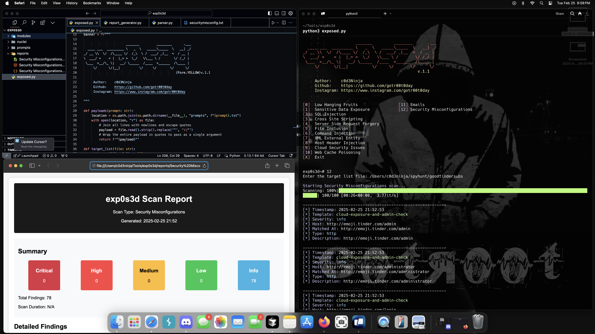

# exp0s3d
exp0s3d is a powerful open-source security testing tool designed for penetration testers, security researchers, and bug bounty hunters. This tool combines multiple vulnerability scanners into one efficient package.

🛡️ Advanced Web Security Testing Tool
==================================================

⚡ Quick Start Guide
------------------
1. Clone the repository:
   git clone https://github.com/gotr00t0day/exp0s3d

2. Install requirements:
   pip install -r requirements.txt

3. Run the tool:
   python3 exp0s3d.py

🔥 Key Features
-------------
• Low Hanging Fruits Scanner 
• SQL Injection Detection 
• XSS Testing 
• SSRF Scanner 
• File Inclusion Checks 
• Command Injection Testing 
• XXE Detection 
• Host Header Injection Scanner 
• Cloud Security Analyzer 
• Web Cache Poisoning Tests 

🛠️ Requirements
-------------
• Python 3.x 
• Nuclei 
• Required Python packages (see requirements.txt) 

🔑 Nuclei AI Authentication
--------------------
• First, visit https://cloud.projectdiscovery.io to create a free PDCP API key.
• Run the nuclei -auth command in your terminal.
• When prompted, enter the API key you obtained from the PDCP website.

🎯 Who Is This For?
----------------
• Penetration Testers 
• Security Researchers 
• Bug Bounty Hunters 
• Red Team Members 
• Security Engineers 

⚠️ Disclaimer
-----------
This tool is for educational and authorized testing purposes only. Always obtain proper authorization before testing any systems.

💡 Support
--------
If you find this tool useful, please consider:
• Starring the GitHub repository 
• Subscribing to this channel 
• Sharing with your network 

✨ Stay tuned for more tutorials and updates! Don't forget to like and follow! 🔔
